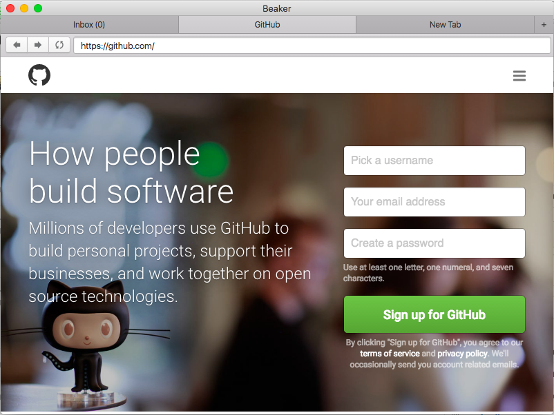

beaker browser
======

This is a highly opinionated and standards-noncompliant browser.
It has its own APIs for decentralized software.

Current status is developer preview.
Not for wide use.
Please feel free to open usability issues.



## building and project structure

Requires node 6.2.1.

```
git clone https://github.com/pfrazee/beaker.git
cd beaker
npm install
npm run rebuild #see below
npm start
```

Unfortunately, due to [electron#5851](https://github.com/electron/electron/issues/5851), you have to rebuild all native components from source.
That's what `npm run rebuild` achieves.

**In case of emergency** If you pull latest from the repo and get weird module errors, do:

```
npm run burnthemall
```

This invokes [the mad king](http://nerdist.com/wp-content/uploads/2016/05/the-mad-king-game-of-thrones.jpg), who will torch your npm_modules, and do the full install/rebuild process for you.
`npm start` should work afterwards.

If you're working on the codebase, [there's lots of dev instructions and notes here](./build-notes.md)

## plugins

You can install new Web APIs and URL schemes with plugins.

These are not like Chrome or Firefox plugins, as they do not let you change the UI or alter page behaviors.
Plugins can only add Web APIs and URL schemes.

**Howto: [Authoring Plugins](./doc/authoring-plugins.md)**

## available plugins

 - [beaker-plugin-dat](https://github.com/pfrazee/beaker-plugin-dat). Adds support for browsing the [Dat Network](http://dat-data.com/). Comes pre-installed with Beaker. 
 - [beaker-plugin-ipfs](https://github.com/pfrazee/beaker-plugin-ipfs). Adds support for browsing the [IPFS Network](https://ipfs.io/).

Submit a PR to have your plugin added to this list.

### installing plugins

To install a new plugin, go to the `app` directory and run `npm install <plugin-name>`.
For example, to install the IPFS plugin:

```bash
# assuming you cloned beaker into ~/beaker:
cd ~/beaker/app
npm install beaker-plugin-ipfs
```

## wherefore

For context, watch the talks from the [Decentralized Web Summit](http://www.decentralizedweb.net/).

There are a lot of new protocols and federated services in development, and almost all of them need a browser.
A bad solution would be for each team to create their own browser, not just because of the duplicated effort, but because decentralized apps need more than just one new solution: they need to handle publishing, file-storage and file-sync, user identities, push-messaging, and much more.
With Beaker, the goal is to advance all of these technologies at once by providing a shared development space.
Users can install these experimental techs as plugins; gain new URL schemes and WebAPIs as a result; and then author applications to see what works.

## license

The MIT License (MIT)

Copyright (c) 2016 Paul Frazee

Permission is hereby granted, free of charge, to any person obtaining a copy
of this software and associated documentation files (the "Software"), to deal
in the Software without restriction, including without limitation the rights
to use, copy, modify, merge, publish, distribute, sublicense, and/or sell
copies of the Software, and to permit persons to whom the Software is
furnished to do so, subject to the following conditions:

 1. Any project using the Software will include a link to the Beaker project page,
along with a statement of credit. (eg "Forked from Beaker")

 2. The above copyright notice and this permission notice shall be included in all
copies or substantial portions of the Software.

THE SOFTWARE IS PROVIDED "AS IS", WITHOUT WARRANTY OF ANY KIND, EXPRESS OR
IMPLIED, INCLUDING BUT NOT LIMITED TO THE WARRANTIES OF MERCHANTABILITY,
FITNESS FOR A PARTICULAR PURPOSE AND NONINFRINGEMENT. IN NO EVENT SHALL THE
AUTHORS OR COPYRIGHT HOLDERS BE LIABLE FOR ANY CLAIM, DAMAGES OR OTHER
LIABILITY, WHETHER IN AN ACTION OF CONTRACT, TORT OR OTHERWISE, ARISING FROM,
OUT OF OR IN CONNECTION WITH THE SOFTWARE OR THE USE OR OTHER DEALINGS IN THE
SOFTWARE.
