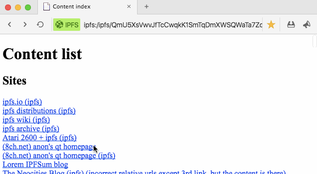

beaker browser
======

Beaker is a browser for IPFS and Dat.
It's licensed MIT, and supports plugins for adding new protocols and Web APIs.
[Read the introduction](http://pfrazee.github.io/2016/08/10/beaker-browser-0.1.html).

Please feel free to open usability issues. Join us at #beakerbrowser on Freenode.

### [Demo video](https://www.youtube.com/watch?v=nKHJ4rLN9mo)

[](https://www.youtube.com/watch?v=nKHJ4rLN9mo)

## Binaries

### [OSX 64-bit](https://github.com/pfrazee/beaker/releases/download/0.1.0/beaker-browser-v0.1.0-darwin-x64.dmg)

## Building from source

Requires node 6.2.1.
In linux (possibly also OSX) you need libtool, m4, and automake.

```
sudo apt-get install libtool m4 automake
```

To build:

```
git clone https://github.com/pfrazee/beaker.git
cd beaker
npm install
npm run rebuild #see https://github.com/electron/electron/issues/5851
npm start
```

If you pull latest from the repo and get weird module errors, do:

```
npm run burnthemall
```

This invokes [the mad king](http://nerdist.com/wp-content/uploads/2016/05/the-mad-king-game-of-thrones.jpg), who will torch your npm_modules, and do the full install/rebuild process for you.
`npm start` should work afterwards.

If you're doing development, `npm run watch` to have assets build automatically.

## Documentation

 - [Using IPFS](./doc/using-ipfs.md)
 - [Using Dat](./doc/using-dat.md)
 - [Dat vs. IPFS: What's the difference?](./doc/dat-vs-ipfs-comparison.md)
 - Howto: [Authoring Protocol Plugins](./doc/authoring-plugins.md)
 - [Codebase & build notes](./build-notes.md)

## License

Modified MIT License (MIT)

Copyright (c) 2016 Paul Frazee

Permission is hereby granted, free of charge, to any person obtaining a copy
of this software and associated documentation files (the "Software"), to deal
in the Software without restriction, including without limitation the rights
to use, copy, modify, merge, publish, distribute, sublicense, and/or sell
copies of the Software, and to permit persons to whom the Software is
furnished to do so, subject to the following conditions:

 1. Any project using the Software will include a link to the Beaker project page,
along with a statement of credit. (eg "Forked from Beaker")

 2. The above copyright notice and this permission notice shall be included in all
copies or substantial portions of the Software.

THE SOFTWARE IS PROVIDED "AS IS", WITHOUT WARRANTY OF ANY KIND, EXPRESS OR
IMPLIED, INCLUDING BUT NOT LIMITED TO THE WARRANTIES OF MERCHANTABILITY,
FITNESS FOR A PARTICULAR PURPOSE AND NONINFRINGEMENT. IN NO EVENT SHALL THE
AUTHORS OR COPYRIGHT HOLDERS BE LIABLE FOR ANY CLAIM, DAMAGES OR OTHER
LIABILITY, WHETHER IN AN ACTION OF CONTRACT, TORT OR OTHERWISE, ARISING FROM,
OUT OF OR IN CONNECTION WITH THE SOFTWARE OR THE USE OR OTHER DEALINGS IN THE
SOFTWARE.
