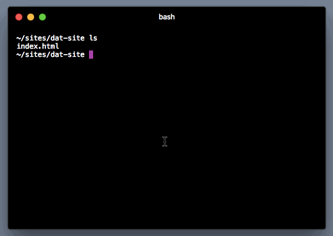
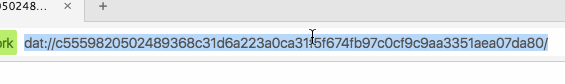
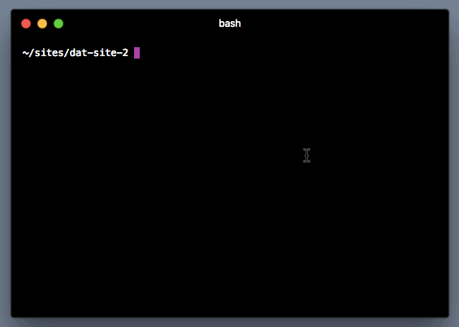

# Using Dat

Install dat with npm:

```
npm install -g dat
```

## Hosting a site

Dat allows you to host a site, or folder, directly from your device.



Once the process has started, you can share the hex-string as a URL, and open it by pasting the URL into your browser.
You may want to add `dat://` to the front of it, but Beaker will automatically add that if you don't.

Note: to be sure that friends can find the site, be sure to leave your device online with the sharing-process running, just like any other site.

### Secret sharing

Dat encrypts all connections using the URL itself.
If you want to share a site or folder secretly, just make sure that only your intended recipient receives the link.
This requires a secret connection!
Anybody with the URL will be able to open it.

## Cloning a site

To copy a site from your browser, first copy the hex-string out of the url:



Then, paste it into the CLI as part of the following command:



Once the download is complete, you can stop the process and examine the files.

## More information

http://docs.dat-data.com/