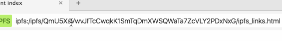

# Using IPFS

Install IPFS by downloading the binary from https://ipfs.io/docs/install/
You'll then want to start the daemon, using:

```
ipfs daemon
```

If the IPFS daemon is not already running, then Beaker will start one for you.

## Hosting a site

IPFS allows you to host a site, or folder, directly from your device.


After the process completes, copy the url (as in the gif above) and prefix it with `ipfs:/ipfs/`.
You now have a valid IPFS url.

For reference, here is a valid URL: `ipfs:/ipfs/QmU5XsVwvJfTcCwqkK1SmTqDmXWSQWaTa7ZcVLY2PDxNxG/`

Note: to be sure that friends can find the site, be sure to leave your device online with the IPFS daemon running.

## Cloning a site

To copy a site from your browser, first copy the base58-string out of the url:



Then, paste it into the CLI as part of the following command:


Once the download is complete, you can examine the files.

## More information

https://ipfs.io/docs/